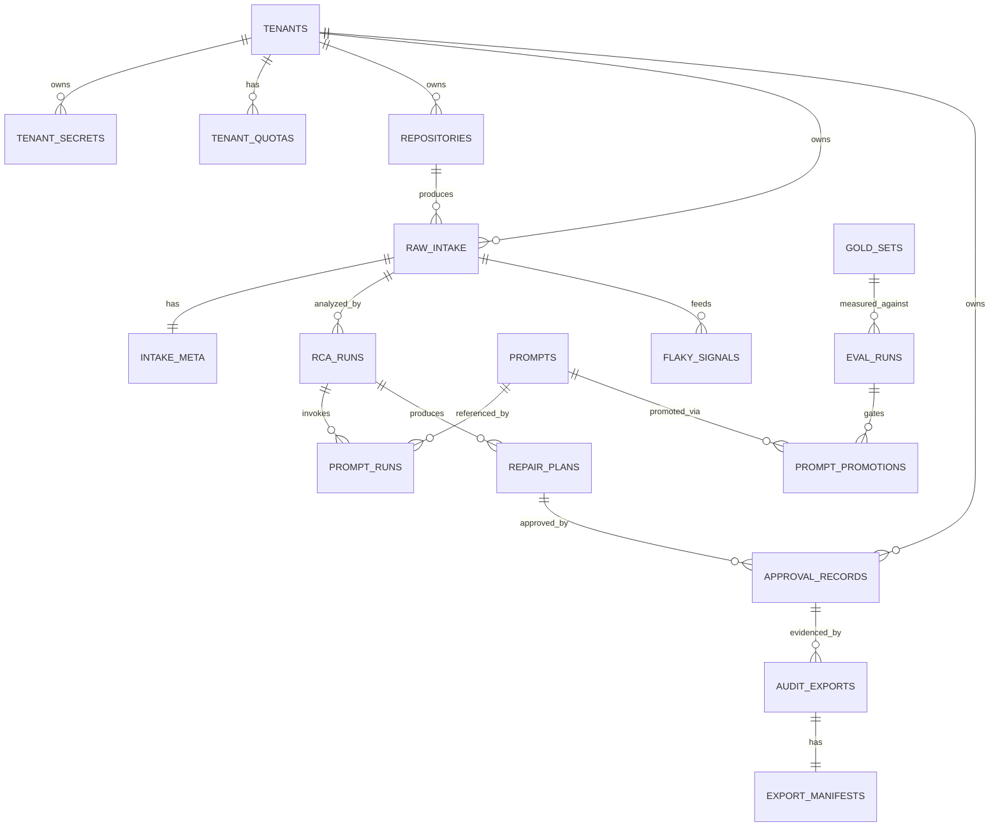

# MendoraCI_DataModelERD_20260517_1130

**Document Type:** Data Model / ERD / Schema Control Book
**Version:** 2026-05-17 11:30 DEEP

---

## 1. Entity-Relationship Overview



---

## 2. Table Catalog (DB-001..DB-018)

| DB-ID | Table | Purpose | Data class | Retention | RLS |
|---|---|---|---|---|---|
| DB-001 | raw_intake | Masked CI failure artifact body | C3 | 18mo + 10y archive | tenant_id |
| DB-002 | intake_meta | Intake metadata (provider, run_id, attempt) | C2 | Same as raw_intake | tenant_id |
| DB-003 | repositories | Linked GitHub repos | C2 | 24mo | tenant_id |
| DB-004 | tenant_secrets | Encrypted PATs, OAuth tokens | C4 (encrypted) | Until revoked | tenant_id |
| DB-005 | rca_runs | RCA result per intake | C3 | 10y | tenant_id |
| DB-006 | prompt_runs | Per-inference log with pins | C3 | 10y (Article 12) | tenant_id |
| DB-007 | repair_plans | Generated repair plans | C3 | 10y | tenant_id |
| DB-008 | approval_records | Append-only HITL signatures | C5 (PII separated) | 10y (Article 18) | tenant_id |
| DB-009 | audit_exports | Evidence export receipts | C3 | 10y | tenant_id |
| DB-010 | export_manifests | Manifest JSON per export | C3 | 10y | tenant_id |
| DB-011 | kpi_rollups | Aggregated KPIs | C2 | 24mo | tenant_id |
| DB-012 | evidence_events | Raw event capture for KPIs | C2 | 24mo | tenant_id |
| DB-013 | mask_policies | Versioned mask rule sets | C2 | Indefinite | global |
| DB-014 | prompts | Versioned prompt registry | C2 | Indefinite | global |
| DB-015 | prompt_promotions | Promotion decision ledger | C2 | Indefinite | global |
| DB-016 | flaky_signals | Flaky test history | C2 | 24mo | tenant_id |
| DB-017 | eval_runs | EVAL gate run results | C2 | Indefinite | global |
| DB-018 | gold_sets | Versioned gold-set metadata | C2 | Indefinite | global |

---

## 3. Selected Field-Level Detail

### DB-001 raw_intake
| Field | Type | Index | Notes |
|---|---|---|---|
| intake_id | UUID PK | yes | |
| tenant_id | UUID FK tenants | yes (RLS) | |
| body_masked | TEXT | — | post-Mask-Policy-v1 |
| mask_policy_version | VARCHAR(16) | — | pin |
| received_at | TIMESTAMPTZ | yes | |
| provider | ENUM('github','jenkins','circleci','gitlab','buildkite') | — | |
| size_bytes | BIGINT | — | ≤ 50MB |
| lineage_chain | JSONB | yes (GIN) | end-to-end IDs |

### DB-006 prompt_runs
| Field | Type | Index | Notes |
|---|---|---|---|
| run_id | UUID PK | yes | |
| tenant_id | UUID FK | yes (RLS) | |
| prompt_version | VARCHAR FK prompts | yes | pin |
| model_id | VARCHAR | yes | pin |
| gold_set_version | VARCHAR FK gold_sets | yes | pin |
| mask_policy_version | VARCHAR FK mask_policies | yes | pin |
| input_hash | VARCHAR(64) | yes | SHA-256 post-mask |
| output | JSONB | — | |
| latency_ms | INTEGER | — | |
| confidence | NUMERIC(4,3) | yes | |
| created_at | TIMESTAMPTZ | yes | |

### DB-008 approval_records (append-only)
| Field | Type | Index | Notes |
|---|---|---|---|
| approval_id | UUID PK | yes | |
| tenant_id | UUID FK | yes (RLS) | |
| plan_id | UUID FK repair_plans | yes | |
| operator_id | UUID FK users | yes | |
| decision | ENUM('approved','rejected') | — | |
| justification_text | TEXT | — | min 20 chars (CHECK constraint) |
| plan_hash | VARCHAR(64) | — | of plan_id at sign time |
| hmac_signature | VARCHAR(64) | — | tenant-rooted key |
| signed_at | TIMESTAMPTZ | yes | |
| approver_role | VARCHAR | — | snapshot |

Append-only enforced by: trigger preventing UPDATE/DELETE.

---

## 4. Retention & Archival Policy

| Storage tier | Tables | Retention rule |
|---|---|---|
| Hot (Postgres primary) | raw_intake (active), intake_meta, rca_runs, repair_plans, approval_records, audit_exports, kpi_rollups | 18 months |
| Warm (Postgres replica + S3 export weekly) | raw_intake archived rows | 18mo–10y |
| Cold immutable (S3 Object Lock, Glacier optional) | prompt_runs, approval_records, audit_exports, export_manifests | 10 years (Article 12/18) |

---

## 5. Index & Partitioning Strategy

- `raw_intake`, `prompt_runs`, `approval_records`, `audit_exports`: partition by month on `created_at` (or `signed_at`)
- Hot partitions kept on SSD; cold partitions detached → S3
- All `tenant_id` columns indexed; RLS policies enforce row-level scope per session

---

## 6. RLS Policy Pattern

```sql
ALTER TABLE raw_intake ENABLE ROW LEVEL SECURITY;
CREATE POLICY tenant_isolation_raw_intake ON raw_intake
  USING (tenant_id = current_setting('app.tenant_id')::uuid);
```

Application sets `SET LOCAL app.tenant_id = '...'` after auth. Cross-tenant queries impossible at DB layer.

---

## 7. Encryption

- Disk-level: AES-256 at rest (cloud-managed)
- Field-level: `tenant_secrets.pat_encrypted` AES-256-GCM with per-tenant DEK rooted in KMS
- Per-tenant KMS keys; quarterly rotation; failed rotation pages security
