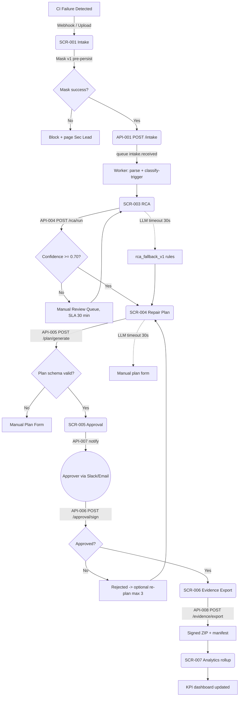

# MendoraCI_ExecutionControlBook_20260517_1130

**Document Type:** Execution Control Book — Sigma-Style, Deep Enhanced
**Version:** 2026-05-17 11:30 DEEP

---

## 1. End-to-End Sigma Flow

**Sub-flows:**
- Error path: service failure → DLQ → daily inspection (>50/hr → incident)
- Validation failure: schema-invalid → 422 with `validation_errors[]`, no DB write
- Retry: exponential 1s/4s/16s, max 5 attempts
- Tenant-isolation guard: every API checks `tenant_id == auth.tenant_id`; mismatch → 403 + alert

---

## 2. Screen Control Sheets (SCR-001..SCR-007)

### SCR-001 — CI Log Intake

**Wireframe:** Three-pane. Left: tenant/repo selector + intake-source tabs (Webhook URL, Direct Upload, Manual JUnit XML). Center: intake history table with status badges. Right: detail drawer with masked artifact preview + "Open RCA" CTA.

**Component state machine:**

| Component | States |
|---|---|
| Drop-zone | idle → dragover → uploading → masked-preview → submitted → error |
| Intake row | received → masking → masked → classifying → rca-done → plan-ready → awaiting-approval → approved/rejected → exported |
| Webhook URL | hidden until tenant_admin; copy-to-clipboard with auto-rotate CTA |

**Validations & errors:**
- File >50MB → "Artifact exceeds 50 MB limit. Split your archive or contact support." (413)
- Unsupported MIME → "Only .log, .txt, .xml, .zip accepted."
- Mask engine failure → "We could not safely mask secrets in this artifact. Submission blocked. Engineering notified."

**API:** POST /intake (API-001) with Idempotency-Key required; GET /intake/{id} (API-002)
**DB:** raw_intake, intake_meta, idempotency_keys
**Queue:** intake.received (consumer: mask + parse worker)
**Acceptance & exit:** TEST-001..004; p95 ≤ 5s ingest; 100% masked-before-persist
**Demo state:** drop pre-seeded `jenkins_oom_failure.log`; mask animation reveals `AKIA****`, `ghp_****`
**Accessibility:** drop-zone keyboard-operable; ARIA-live status; color-blind-safe palette
**Mobile:** intake table collapses to cards <768px; drop-zone hidden <480px
**i18n:** all strings externalized; `Intl.DateTimeFormat`

---

### SCR-002 — Repository Linking

**Wireframe:** Linked-repos list with status pills (linked / re-auth-required / archived). Primary CTA "Link via GitHub OAuth"; secondary "Link via PAT (advanced)."

**State:** unlinked → linking → linked → re-auth-required → revoked → archived

**Validations:**
- OAuth `state` mismatch → "Authorization could not be completed. Please retry." (security event logged)
- PAT scope insufficient → "Token missing required scopes: contents:read, actions:read, checks:read, pull_requests:read"
- Org SSO required → "Your organization requires SAML SSO. [Request bypass token]."

**API:** API-003 POST /repos/link
**DB:** repos, tenant_secrets (AES-256-GCM, KMS-rooted)
**Queue:** repo.linked
**Exit:** TEST-005..007
**Demo state:** Pre-seeded OAuth callback; click → row turns green within 2s

---

### SCR-003 — Root Cause Analysis

**Wireframe:** Two-column. Left: masked-artifact viewer (read-only Monaco). Right: RCA card with class + confidence chip, top-3 alternatives, explainability snippet, "Generate Repair Plan" CTA. Confidence <0.70: amber banner "Needs human review — please confirm class."

**State:** classifying → confidence-known → manual-review-needed | rca-confirmed → plan-pending

**Validations:**
- Manual class override: justification ≥ 20 chars
- Confidence chip click → expandable rationale

**API:** API-004 POST /rca/run + GET
**DB:** rca_runs, prompt_runs (pins prompt_version, model_id, gold_set_version, mask_policy_version)
**Queue:** rca.completed | rca.manual_review
**Exit:** EVAL-001 ≥ 85% MVP; TEST-008..010
**Demo state:** "Class: oom (0.93) | Alt: race (0.06) | Alt: timeout (0.02)" with rationale "Pattern: process killed at line 421"

---

### SCR-004 — Repair Planning

**Wireframe:** Plan card with hypothesis, ordered typed step list (chips + body + blast-radius chip + rollback note), alternatives accordion, "Edit plan" + "Send for Approval" CTAs.

**State:** plan-generating → plan-ready → editing → sent-for-approval → approved/rejected

**Validations:**
- Plan JSON Schema invalid → fallback to manual-plan form
- Touches `main`/`prod` → red banner + force dual-approval
- Suggests secret rotation → force security_approver role

**API:** API-005 POST /plan/generate
**DB:** repair_plans (immutable per version; edits create new version with prev_plan_id)
**Queue:** plan.generated
**Exit:** EVAL-002 ≥ 80% MVP; TEST-011..013
**Demo state:** "Step 1: raise container memory 2G→4G (config, medium blast). Step 2: investigate leak in parser.py (code, low blast). Alt: enable JVM heap-dump. Rollback: revert memory."

---

### SCR-005 — Approval Workflow

**Wireframe:** Plan summary; identity strip ("You are signing as Lin Park, security_approver"); justification textarea (min 20 chars, counter); plan-hash readout; large Approve + Reject buttons. Below: prior action audit trail.

**State:** unsigned → signing → signed | rejected | token-expired (4 hrs)

**Validations:**
- Justification < 20 → button disabled with helper
- Plan hash drift since notify → reload with banner "Plan was edited; approval link invalidated"
- Approver not in required role → "Required role: security_approver"

**API:** API-006 POST /approval/sign; API-007 POST /approval/notify
**DB:** approval_records (append-only constraint); notification_log
**Queue:** approval.signed; notify.email; notify.slack
**Exit:** 100% executed plans signed (TEST-014, 014-A, 016)
**Demo state:** approver clicks deep-link → page renders with summary + identity + textarea pre-filled "Approved — quarantine is minimal risk; will revisit Tuesday." → Approve → audit-trail row appears with timestamp + signature

---

### SCR-006 — Evidence Export

**Wireframe:** Filter pane (date range, repo, incident status). Preview table. "Export Evidence Pack" CTA. Below: prior exports with status (queued / signing / ready / failed / expired).

**State (export job):** queued → collecting → signing → ready → expired (30 days, signed URL rolls)

**Validations:**
- Empty filter → button disabled
- Cross-tenant attempt → 403 + audit log
- >100 MB → "Export will be split into archives; manifest links them"

**API:** API-008 POST /evidence/export
**DB:** audit_exports, export_manifests
**Queue:** evidence.signed
**Exit:** TEST-018..020; offline HMAC verification; 10-year retention configured
**Demo state:** export "Last 7 days" → progress bar → ZIP downloads → contains manifest.json, masked artifacts, rca/, plans/, approvals/, evals/, prompts/, signature

---

### SCR-007 — Analytics Dashboard

**Wireframe:** 5 KPI tiles row (MTTR, debugging time, flaky recurrence, evidence completeness, approval cycle). Trend strip per tile. Filter bar (window 30/60/90, repo, team). Drill-through to incident list. Admin tab (tenant_admin only) for cost-ceiling + prompt-promotion + EVAL drift status.

**State:** loading → loaded → drilled-into-incident

**Validations:**
- Sparse data (<10 incidents) → tile shows "Insufficient data; ≥ 10 incidents required."
- TZ mismatch on rollups → display tenant-default TZ + UTC tooltip

**API:** API-009 GET /analytics/*
**DB:** kpi_rollups, evidence_events
**Queue:** rollup batch fires every 15 min
**Exit:** p95 ≤ 2s; TEST-021, 021-A, 022
**Demo state:** MTTR tile dropping 4.2h → 1.6h over 30 days; flaky-recurrence trending toward 50% reduction

---

## 3. Backend & Queue Map (expanded)

| Service | SLA | Error handling | Retry | DLQ | Idempotency key | OTel spans |
|---|---|---|---|---|---|---|
| Intake API | p95 5s | 4xx return; 5xx retry-after | n/a (synchronous) | n/a | Idempotency-Key header | intake.accept |
| Mask Worker | p95 2s | Block + alert on failure | 1s/4s/16s × 5 | intake.mask.DLQ | intake_id | mask.apply |
| RCA Worker | p95 8s | Timeout → fallback rules | 0 (fallback covers) | rca.run.DLQ | intake_id+model_id+prompt_version | rca.inference |
| Plan Worker | p95 10s | Timeout → manual form | 0 | plan.gen.DLQ | rca_run_id | plan.generate |
| Notify Worker | p95 5s | Webhook fail → email fallback | 1s/4s/16s × 5 | notify.DLQ | plan_id+channel | approval.notify |
| Signer Worker | p95 4s | Key unavailable → block, page | 1s/4s × 3 | export.signer.DLQ | export_id | evidence.sign |
| Rollup Worker | every 15min | Idempotent merge | n/a | rollup.DLQ | tenant_id+window_start | analytics.rollup |

**Cross-cutting:** all workers carry tenant_id in context; logs/metrics tagged. Cost meter increments per LLM call in `tenant_quotas`; soft alert 80%, hard throttle 100%.

---

## 4. Failure Modes & Recovery

### Per-screen failure modes

| Failure | Surface | User-visible response | Recovery |
|---|---|---|---|
| SCR-001 mask engine fails | Drop-zone | Red banner; "blocked" status | Sec Lead pages; engine rollback |
| SCR-002 OAuth code reuse | Repo-link | "Authorization could not be completed" | Re-issue state; security audit log |
| SCR-003 RCA model timeout | RCA card amber | "Using rules fallback — confidence reduced" | Engineer overrides class |
| SCR-004 plan schema invalid | Plan card | Switches to manual-plan form | Engineer authors plan manually |
| SCR-005 plan hash drift | Approval page | Reload + banner "Plan changed" | New approval link issued |
| SCR-006 signer key down | Export page | Toast "Signing temporarily unavailable" | Page on-call; queued export resumes |
| SCR-007 rollup stale | Tile sub-text | "Updated > 30 min ago" | Auto-retry; alert if stale > 60 min |

### Per-service failure modes

| Service | Failure | Recovery |
|---|---|---|
| LLM provider | Outage | Model fallback registry IMP-023 → fallback model; if all out → `rca_fallback_v1` rules |
| Postgres primary | Failover | Read replicas promote; ≤ 60s blip on writes |
| Redis queue | Down | In-process buffered queue ≤ 5 min; after that 503 on writes |
| Object storage | Down | Sign-and-defer; warn user download available within X minutes |
| KMS | Down | Block writes requiring new DEK; reads continue from cached DEK |

---

## 5. Demo Script (5-minute golden path)

| Time | Step | Action | Expected outcome |
|---|---|---|---|
| 0:00 | Open SCR-001 (tenant "AcmePilot" pre-seeded) | — | Empty intake table |
| 0:20 | Drop `jenkins_oom_failure.log` (15MB) | drag-drop | Mask animation; AKIA****, ghp_**** masked; row appears |
| 0:50 | Click row → opens RCA card | click | "Class: oom (0.93)" with pattern rationale |
| 1:30 | Click "Generate Repair Plan" | button | Plan: "Step 1: raise memory 2G→4G. Step 2: investigate leak. Alt: enable heap-dump." |
| 2:30 | "Send for Approval" — switch to approver tab | button | Slack notification (mocked) in side panel |
| 3:00 | Click approver deep-link → SCR-005 | click | Approval page with plan summary, justification, plan hash |
| 3:30 | Type justification, click Approve & Sign | button | Audit-trail row appears |
| 4:00 | Navigate to SCR-006; "Export last 7 days" | button | Progress bar → ZIP downloads |
| 4:30 | Open ZIP locally → show manifest.json + approvals/AP-1.json + signature | shell | Manifest shows pinned versions; approval has operator_id + justification + plan_hash |
| 5:00 | Show SCR-007: MTTR trending down | tab | Tile reveals 4.2h→1.6h over 30 days |

**Fallback if live demo fails:** pre-recorded `/demo/golden_path.mp4` (IMP-018); deterministic seed data ensures identical state.
