# MendoraCI_RecommendedEnhancements_20260517_1130

**Document Type:** Recommended Enhancements Register — Deep Enhanced
**Version:** 2026-05-17 11:30 DEEP

---

## 1. Register (IMP-001..IMP-025)

| IMP | Title | Phase | Effort (hrs) | Dependency | Value statement | Success criteria | Risk if skipped | Linked RT/RC |
|---|---|---|---|---|---|---|---|---|
| IMP-001 | Mask v1 pattern set (AWS / GCP / GitHub / generic) | 1 | 24 | none | Zero-leak baseline | TEST-023 0 leaks N=500 | Product-existential (R-02) | RT-008, RC-014 |
| IMP-002 | GitHub OAuth app submission | 1 | 8 | GitHub dev registration | Production-grade auth | OAuth review approved | OAuth delay → demo blocker | RT-002, RC-002 |
| IMP-003 | Idempotency-Key middleware | 1 | 12 | none | At-least-once delivery safety | TEST-001-A 0 duplicates | Webhook replays corrupt state | RT-015, RC-023 |
| IMP-004 | Approval signature scheme (HMAC + operator_id + plan_hash) | 2 | 20 | crypto library | Article 12 evidence quality | Offline verification proven | Approvals not Article 12 evidence | RT-005, RC-005 |
| IMP-005 | Evidence ZIP signer + manifest schema v1 | 2 | 32 | IMP-004 | Auditor-consumable export | TEST-018/019/027 green | Customers cannot pass audit | RT-006, RT-011 |
| IMP-006 | Prompt registry mirror (Postgres) + Git source | 2 | 24 | none | PromptOps governance | Promotion blocked on red EVAL | Prompt drift unmanaged | RT-009 |
| IMP-007 | EVAL gate CI integration (blocking) | 2 | 16 | gold sets seeded | Quality floor enforced | Red EVAL blocks merge | Silent quality regressions | RT-012, RC-016 |
| IMP-008 | Analytics rollup batch (15-min cron) | 3 | 16 | DB-011 | Dashboard freshness | TEST-021 p95 ≤ 2s | KPI staleness erodes trust | RT-007 |
| IMP-009 | Drift detector (PSI on input + output) | 2 | 28 | IMP-007 | Catches slow EVAL degradation | TEST-028-A alert at PSI > 0.2 | Quality regress undetected | RT-003, RT-017, RC-020 |
| IMP-010 | RBAC matrix + enforcement middleware | 2 | 20 | none | Least privilege | TEST-014-A all rows pass | Privilege escalation | RT-014, RC-022 |
| IMP-011 | Slack + email notification adapters | 2 | 16 | OAuth Slack | HITL pull through | Approver round-trip ≤ 22 min | Approval cycle balloons | RT-005 |
| IMP-012 | Analytics CSV export | 3 | 8 | IMP-008 | Customer self-serve reporting | Schema-stable export | CSM does it manually | RT-007 |
| IMP-013 | Approver feedback loop (rejection reason → eval candidate) | 3 | 16 | IMP-007 | Active learning signal | ≥ 80% rejected plans have reason | Model fails to improve | RT-005, RT-003 |
| IMP-014 | Replay/regression harness | 3 | 32 | IMP-006 | Prevents EVAL regressions | TEST-028-B ≥ 95% parity | Silent regressions ship | RT-020, RC-027 |
| IMP-015 | Chaos test pack (workers, LLM, KMS, queue) | 4 | 40 | IMP-005 | Ops maturity | Quarterly game day passes | Untested failure modes | RT-010, RT-013, RC-029 |
| **IMP-016** | **Secret-scanning provider extension (Datadog, Stripe, Cloudflare, Slack, OpenAI, Twilio, Algolia)** | 2 | 24 | IMP-001 | Cover modern secret surface | Red-team N=500 includes 20 providers; 0 leaks | Provider-specific token leaks | RT-008, RC-014 |
| **IMP-017** | **FinOps cost ceiling enforcement (soft 80%, hard 100% throttle, per-tenant)** | 2 | 20 | metering | Margin protection | TEST-021-A throttles correctly | Runaway LLM cost destroys unit economics | RT-016, RC-024 |
| **IMP-018** | **Demo dry-run pack + deterministic seed data** | 3 | 16 | seed scripts | Demo-day reliability | 3 successful dry runs | Live demo failure | (cross), RC-017 |
| **IMP-019** | **On-call rotation pack (PagerDuty config, runbooks, escalation)** | 4 | 24 | IMP-015 | Phase 4 SLO commitment | First rotation runs Week 7 | Incident response chaos | RT-005, RC-010, RC-030 |
| **IMP-020** | **Risk-owner staffing & RLS hardening (named owner per R-01..R-12)** | 4 | 16 | hiring | Risk-register meaningful | All risks have named owner with calendar review | Risks unmitigated | RT-013, RC-006, RC-021 |
| **IMP-021** | **EU data residency configuration (per-tenant region flag, eu-west-1 deploy)** | 4 | 80 | infra | EU-customer unlock | TEST-013-B passes; tenant data resident in eu-west | EU deals lost | RT-019, RC-026 |
| **IMP-022** | **Gold-set governance + monthly label-quality audit (κ ≥ 0.75)** | 2-continuous | 12/mo recurring | Gold sets seeded | Sustained EVAL quality | κ ≥ 0.75 each month; audit report retained | EVAL quality drifts | RT-012, EVAL-001/002 |
| **IMP-023** | **Model fallback registry (primary + secondary LLM + rules)** | 2 | 24 | provider accounts | Vendor resilience | Failover test in staging ≤ 30s | Single-provider outage = product down | RT-003, RT-004, RC-028 |
| **IMP-024** | **Customer-success playbook + QBR template** | 4 | 24 | IMP-008 | Renewal & expansion motion | First QBR delivered Week 12 | NDR < target | RT-014, RT-018, RC-025 |
| **IMP-025** | **Audit-export consumer schema deprecation policy + semver + migration window (≥ 6 mo)** | 3 | 12 | IMP-005 | Downstream consumer trust | Policy doc published; migrations announced 6mo ahead | GRC tools break on schema change | RT-011, RC-015 |

---

## 2. Build Sequence with Critical-Path

```mermaid
gantt
    title MendoraCI Build Sequence (Hackathon + Phase 4)
    dateFormat  X
    axisFormat %s
    section Phase 1
    IMP-001 Mask v1                 :crit, 0, 24
    IMP-002 OAuth submission        :0, 8
    IMP-003 Idempotency             :crit, 0, 12
    section Phase 2
    IMP-007 EVAL gate CI            :crit, 24, 16
    IMP-004 Approval signature      :crit, 24, 20
    IMP-005 Evidence signer         :crit, 44, 32
    IMP-006 Prompt registry         :24, 24
    IMP-009 Drift detector          :76, 28
    IMP-010 RBAC matrix             :24, 20
    IMP-011 Notify adapters         :44, 16
    IMP-016 Secret provider ext     :24, 24
    IMP-017 FinOps cost ceiling     :44, 20
    IMP-022 Gold-set audit (start)  :24, 12
    IMP-023 Model fallback          :60, 24
    section Phase 3
    IMP-008 Rollup batch            :104, 16
    IMP-012 CSV export              :120, 8
    IMP-013 Feedback loop           :128, 16
    IMP-014 Replay harness          :144, 32
    IMP-018 Demo dry-run            :crit, 144, 16
    IMP-025 Schema deprecation      :160, 12
    section Phase 4
    IMP-015 Chaos pack              :176, 40
    IMP-019 On-call rotation        :216, 24
    IMP-020 Risk owner staffing     :240, 16
    IMP-021 EU residency            :176, 80
    IMP-024 CSM playbook            :256, 24
```

**Critical path (hackathon, Phase 1+2+3 — 36 hours):**

`IMP-001 (mask) → IMP-003 (idempotency) → IMP-004 (approval signature) → IMP-007 (EVAL gate) → IMP-005 (evidence signer) → IMP-018 (demo dry-run)`

Slipping any node on this path beyond its slack puts Tier 1 demo at risk. Total ~120 hours wall-clock, parallelized across 4-person team to fit 36-hour window.

---

## 3. Value Density Ranking (Phase 1+2+3)

Sorted by (Tier-1 readiness value) ÷ effort:

| Rank | IMP | Density | Reason |
|---|---|---|---|
| 1 | IMP-007 EVAL gate CI | Highest | 16 hrs unlocks all promotion gates |
| 2 | IMP-018 Demo dry-run | Very high | 16 hrs avoids demo-day disaster |
| 3 | IMP-003 Idempotency | Very high | 12 hrs prevents data corruption |
| 4 | IMP-004 Approval signature | High | 20 hrs is Article 12 anchor |
| 5 | IMP-005 Evidence signer | High | 32 hrs is the audit deliverable |
| 6 | IMP-001 Mask v1 | High | 24 hrs is product-existential floor |
| 7 | IMP-017 FinOps ceiling | Medium-high | 20 hrs protects unit economics |
| 8 | IMP-022 Gold-set audit | Continuous | Small recurring; sustains EVAL |
| 9 | IMP-023 Model fallback | Medium-high | 24 hrs eliminates single-vendor risk |
| 10 | IMP-009 Drift detector | Medium | 28 hrs catches slow regression |
